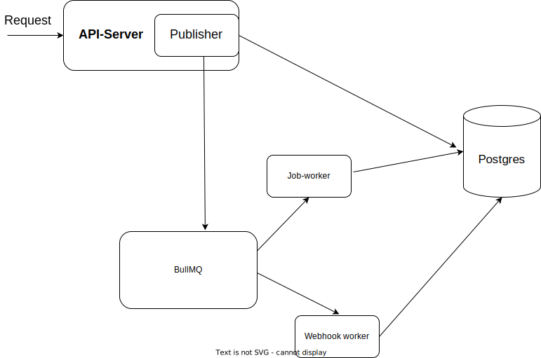

Re-exposing `/sign` url in reliable way

## Prerequisites:

The only prerequisite to run this application is to have docker for the desktop installed. It can be downloaded from [this link](https://docs.docker.com/get-docker/)

 
 

## How to the start the application

Application and all its component can be run on a single command. following are the steps to run it. docker commands must be executed from the root folder

- Clone the repo
- Build using docker-compose `COMPOSE_DOCKER_CLI_BUILD=1 DOCKER_BUILDKIT=1 docker-compose build`
- Run docker-compose using `docker-comose up`

 
 

## Accessing the API

APIs can be accessed at `http://localhost:8000/`
Swagger Doc can be accessed at `http://localhost:8000/swagger`

 
 

## Features

All the features are pretty much inline with [this](https://synthesia.notion.site/Synthesia-Backend-Tech-Challenge-52a82f750aed436fbefcf4d8263a97be) except a few.

 
 

## Caveats

Given problem statement mentions

> Expose a /crypto/sign endpoint with a similar input syntax to ours.

 

I had to deviate from this for following reasons.

- Server is creating resources and hence it cannot be a `GET` request, as per open-api spec.
- `/sign` API is also accepting some additional parameters like `webhookUrl` and headers, Accepting body in a `GET` is not recommended.
- I am accepting `clientRequestId` so that incoming calls and webhook calls can be mapped to an ID in client system.

 
 

## Components

There are 3 major components.

1.  Webserver, for exposing API
2.  Job Worker, for processing requests from the queue.
3.  Webhook worker, for calling webhook urls for succeeded `/crypto/sign`calls

 
 

## Tech Stack

following are the major tools.

- Nodejs
- Postgres
- Redis
- BullMQ - Job Queue, deferred processing
- Fastify - webserver framework for Nodejs Apps
- Prisma - ORM for Nodejs

 
 

## High Level Architecture

 
 

- Get a request to sign a message
- If message already exists in the database and it has been sign by synthesia api,
  - then signedMessage will be returned to the client.
- Else if Synthesia API fails with retry-able error codes(it is configurable).
  - then, this application will accepted the request and return 202 as response.
  - It will push a job to BullMQ with randomized initial delay
  - it will be picked by job-worker and will be retried for configured attempts.
    - it will use exponential/fixed retry strategy as per configuration.
  - If any retry attempt succeeds, then,
    - It will store the response in the db
    - job-worker will push another event
    - this event will be picked by webhook worker
      - if webhook call succeeds in any retry, it will again add webhook response to the database

 
 

## DB Design

    model  ApiCallLog {
    	id String  @id  @default(uuid())
    	requestMessage String
    	webhookUrl String?
    	response String?
    	clientRequestId String?
    	requestStatus Int?
    	retryScheduled Boolean  @default(false)
    	createdAt DateTime  @default(now())
    	updatedAt DateTime  @default(now())
    	webhookCallLog WebhookCallLog[]
    	@@index([requestMessage])
    }
    model  WebhookCallLog {
    	id String  @id  @default(uuid())
    	lastCallResponse String?
    	lastCallResponseStatus Int?
    	lastCalledAt DateTime  @default(now())
    	apiCallLogId String
    	apiCallLogs ApiCallLog?  @relation(fields: [apiCallLogId], references: id)
    }

 
 

## High Level Tasks

- Schema Validation
- Swagger
- Tests
- Metrics Endpoints
- One command run using docker-compose
- Basic API key based AuthN
- Constant time comparison for AuthN to minimise Timing attacks
